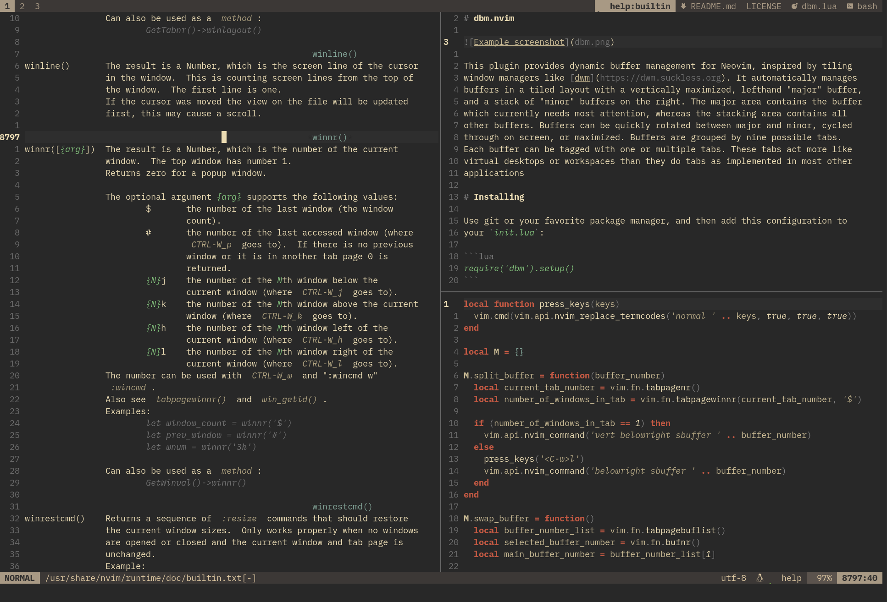

# dbm.nvim



This plugin provides dynamic buffer window management for Neovim, inspired by
tiling window managers like [dwm](https://dwm.suckless.org). It automatically
manages buffer windows in a tiled layout with a vertically maximized, lefthand
"major" buffer window, and a stack of "minor" buffer windows on the right. The
major window contains the buffer which currently needs most attention, whereas
the stacking windows contain all other buffers. Buffer windows can be quickly
rotated between major and minor, cycled through on screen, or maximized. Buffer
windows are grouped by nine possible tabs. Each buffer window can be placed on
one or multiple tabs. These tabs act more like virtual desktops or workspaces
than they do tabs as implemented in most other applications.

# Installing

Use git or your favorite package manager, and then add this configuration to
your `init.lua`:

```lua
require('dbm').setup()
```

## Commands

| command                | description                               |
|------------------------|-------------------------------------------|
|`:DBMNextBuffer`        | Cycle through buffers windows             |
|`:DBMSplitBuffer`       | Open a new buffer window                  |
|`:DBMSwapBuffer`        | Minor buffer window → major buffer window |
|`:DBMToggleFocusBuffer` | Maximize/Minimize major buffer window     |
|`:DBMMoveToTab`         | Send buffer window to tab _n_             |
|`:DBMViewTab`           | Navigate to tab _n_                       |

## Example configuration

If you'd like to use the plugin with the author's keybindings and settings,
add this to your config:

```lua
require('dbm').setup()

vim.opt.hidden = false

local nmap = function(input, output, options)
  vim.api.nvim_set_keymap('n', input, output, options)
end

-- Buffer window navigation
nmap('<M-h>', '<C-w>h', {noremap = true})
nmap('<M-j>', '<C-w>j', {noremap = true})
nmap('<M-k>', '<C-w>k', {noremap = true})
nmap('<M-l>', '<C-w>l', {noremap = true})

-- Buffer window management
nmap('<M-CR>', ':DBMSwapBuffer<CR>',         {noremap = true, silent = true})
nmap('<M-e>',  ':DBMSplit ',                 {noremap = true})
nmap('<M-f>',  ':DBMToggleFocusBuffer<CR>',  {noremap = true, silent = true})
nmap('<M-n>',  ':DBMNextBuffer<CR>',         {noremap = true, silent = true})
nmap('<M-q>',  ':quit<CR>',                  {noremap = true, silent = true})
nmap('<M-t>',  ':DBMSplit<CR>:terminal<CR>', {noremap = true, silent = true})

-- Tab navigation
nmap('<M-1>', ':DBMViewTab 1<CR>', {noremap = true, silent = true})
nmap('<M-2>', ':DBMViewTab 2<CR>', {noremap = true, silent = true})
nmap('<M-3>', ':DBMViewTab 3<CR>', {noremap = true, silent = true})
nmap('<M-4>', ':DBMViewTab 4<CR>', {noremap = true, silent = true})
nmap('<M-5>', ':DBMViewTab 5<CR>', {noremap = true, silent = true})
nmap('<M-6>', ':DBMViewTab 6<CR>', {noremap = true, silent = true})
nmap('<M-7>', ':DBMViewTab 7<CR>', {noremap = true, silent = true})
nmap('<M-8>', ':DBMViewTab 8<CR>', {noremap = true, silent = true})
nmap('<M-9>', ':DBMViewTab 9<CR>', {noremap = true, silent = true})

-- Tab management
nmap('<M-m>1', ':DBMMoveToTab 1<CR>', {noremap = true, silent = true})
nmap('<M-m>2', ':DBMMoveToTab 2<CR>', {noremap = true, silent = true})
nmap('<M-m>3', ':DBMMoveToTab 3<CR>', {noremap = true, silent = true})
nmap('<M-m>4', ':DBMMoveToTab 4<CR>', {noremap = true, silent = true})
nmap('<M-m>5', ':DBMMoveToTab 5<CR>', {noremap = true, silent = true})
nmap('<M-m>6', ':DBMMoveToTab 6<CR>', {noremap = true, silent = true})
nmap('<M-m>7', ':DBMMoveToTab 7<CR>', {noremap = true, silent = true})
nmap('<M-m>8', ':DBMMoveToTab 8<CR>', {noremap = true, silent = true})
nmap('<M-m>9', ':DBMMoveToTab 9<CR>', {noremap = true, silent = true})

-- Status and Tab lines
require('lualine').setup {
  options = {
    globalstatus = true,
    require'lualine'.setup({
      sections = {
        lualine_a = {'mode'},
        lualine_b = {'branch', 'diff', 'diagnostics'},
        lualine_c = {{'filename', path = 1}},
        lualine_x = {'encoding', 'fileformat', 'filetype'},
        lualine_y = {'progress'},
        lualine_z = {'location'}
      },
      tabline = {
        lualine_a = {'tabs'},
        lualine_b = {},
        lualine_c = {},
        lualine_x = {},
        lualine_y = {},
        lualine_z = {'buffers'}
      }
    })
  }
}
```

